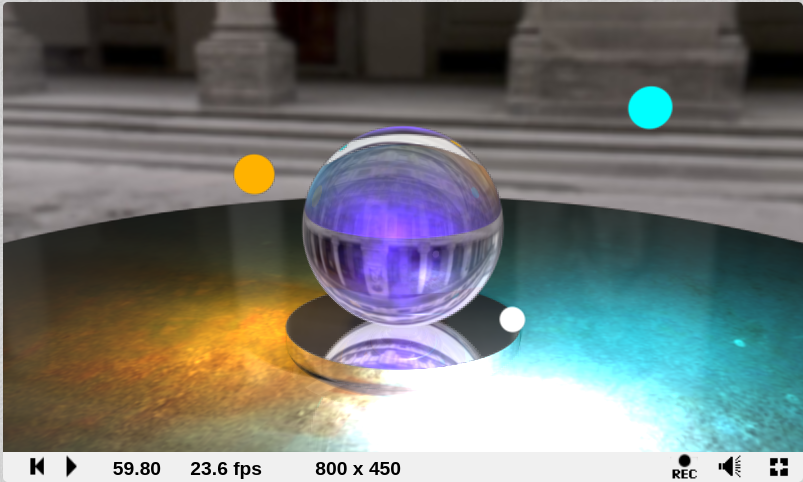
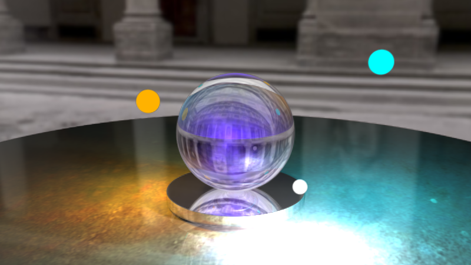
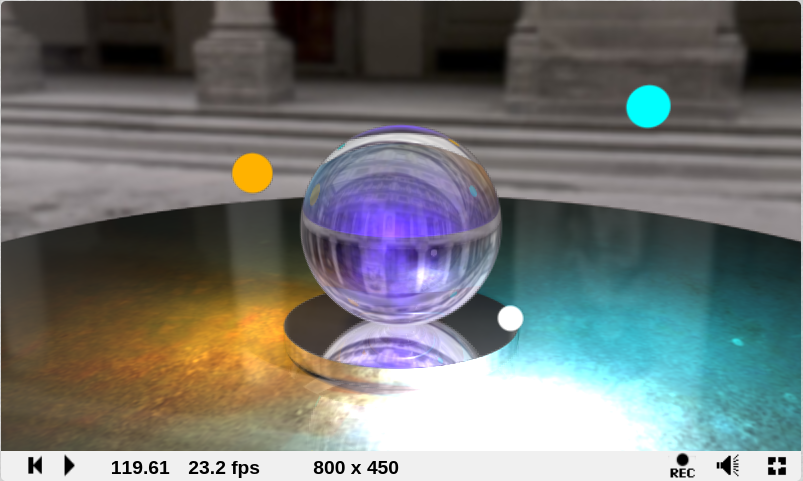
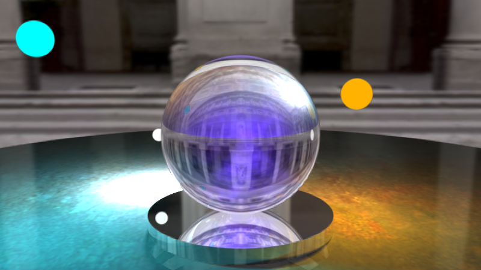
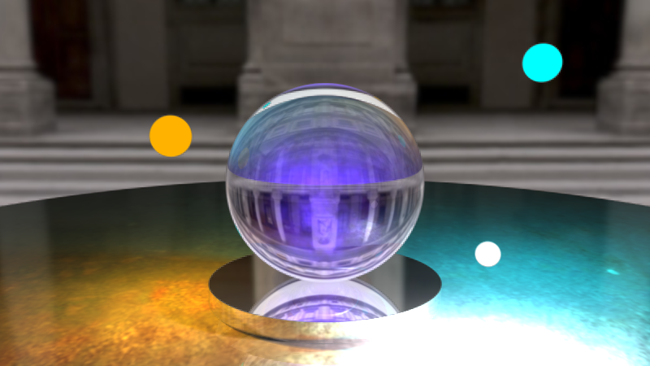
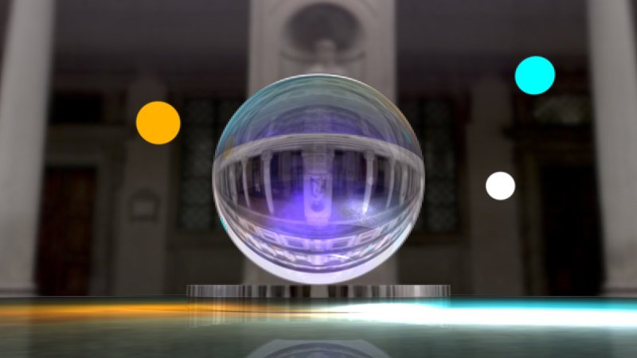
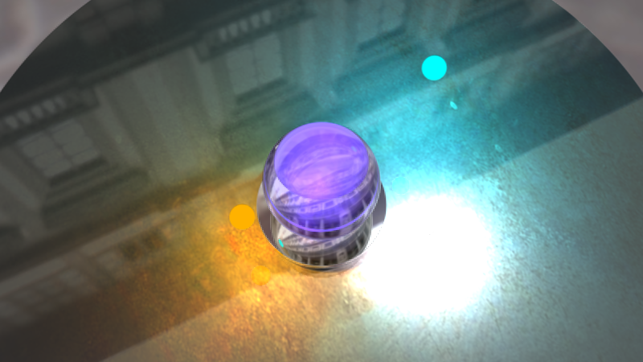
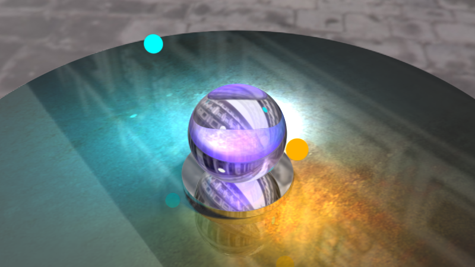
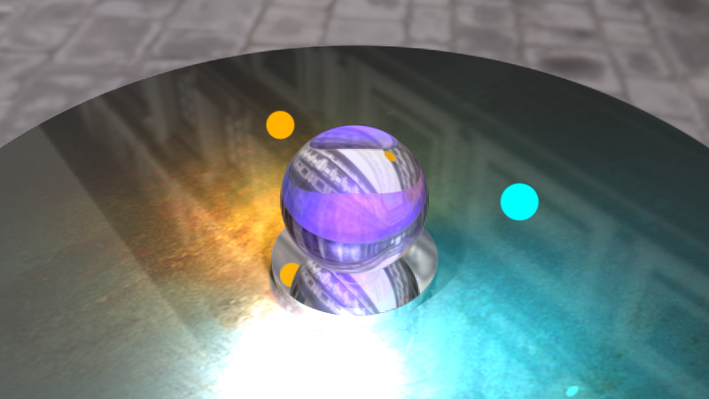

# Практикум по Компьютерной графике

#### **Задание 2. Трассировка лучей**  
--------------------------------------------  

## Исходный код шейдера  
 
  

## Вариант задания  

Разноцветный светящийся дым в шаре

## Описание выполненных пунктов задания  

### Базовая часть  

* Отражение и преломление реализованы с помощью формул Френеля.  
* Дым внутри кристалла полупрозрачный, его граница плавно переходит в стекло.  
* Кристалл стоит на цилиндрической подставке.  
* В сцене присутствует три источника света, отражающиеся в стекле кристалла.  
* Рендеринг изображения в нормальном качестве занимает 1 минуту, максимальное качество достигается за 2 минуты.  

Изображение, сгенерированное за 1 минуту:   
Подтверждение того, что оно действительно сгенерировано за 1 минуту: 
Изображение, сгенерированное за 2 минуты:   
Подтверждение того, что оно действительно сгенерировано за 2 минуты:   

### Дополнительная часть  

* Мягкие тени  
* Анти-алиасинг  
* Окружение в виде текстурированной плоскости  
* Окружение в виде текстурированного куб-мапа  
* Сцена выглядит реалистично  

## Изображения полученной сцены с разных ракурсов камеры  
 
   
   
  
  
  
 
